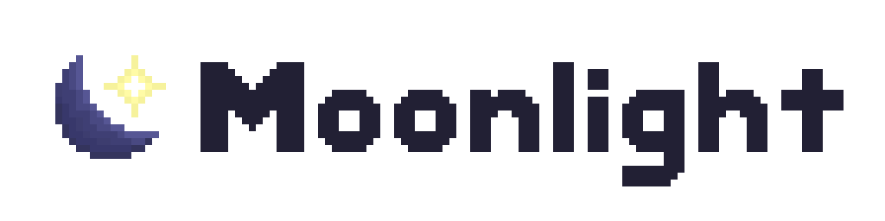

<h3 align="center">
  <picture>
    <source media="(prefers-color-scheme: dark)" srcset="./img/wordmark-light.png">
    <source media="(prefers-color-scheme: light)" srcset="./img/wordmark.png">
    
  </picture>

<a href="https://discord.gg/FdZBTFCP6F">Discord server</a>
\- <a href="https://github.com/moonlight-mod/moonlight">GitHub</a>
\- <a href="https://moonlight-mod.github.io/">Docs</a>

  

</h3>

**moonlight** is yet another Discord client mod, focused on providing a decent user and developer experience.

moonlight is heavily inspired by hh3 (a private client mod) and the projects before it that it is inspired by, namely EndPwn. All core code is original or used with permission from their respective authors where not copyleft.

**_This is an experimental passion project._** moonlight was not created out of malicious intent nor intended to seriously compete with other mods. Anything and everything is subject to change.

moonlight is licensed under the [GNU Lesser General Public License](https://www.gnu.org/licenses/lgpl-3.0.html) (`LGPL-3.0-or-later`). See [the documentation](https://moonlight-mod.github.io/) for more information.
